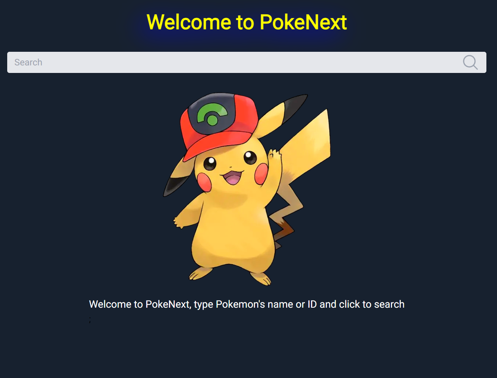
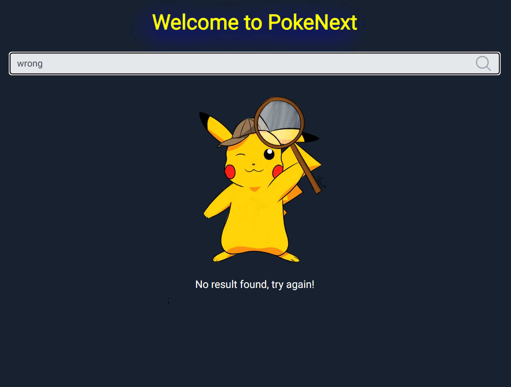
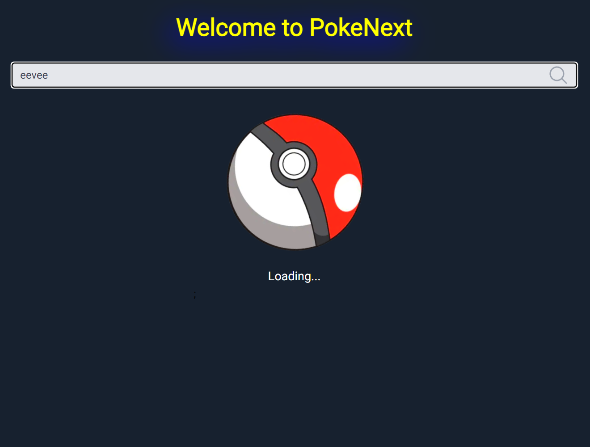
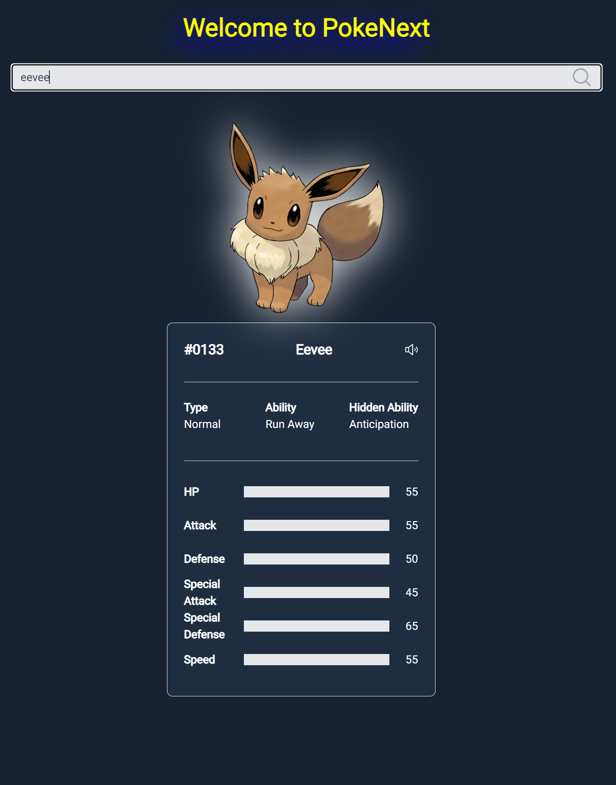

# PokeNext

This is a [Next.js](https://nextjs.org/) project bootstrapped with [`create-next-app`](https://github.com/vercel/next.js/tree/canary/packages/create-next-app) to show pokemon details with data provided from [PokeAPI](https://pokeapi.co/).

## Requirements

- Node 20
- Docker
- Redis

## Technologies

- React to build UI Components
- Tailwind to style UI Components
- Nextjs to implement API routes and serve application
- Redis to store data in cache
- Docker to run application and its dependencies

## Layout

  
  
  

  

## Running project

### With Docker
Once project is dockerized, just run `docker-compose up` to execute build, start Redis instance and Nextjs application on http://localhost:3000.

### Without Docker
**Attention**: To run this project without Docker you make sure Redis is running on your machine to avoid unexpected behavior.

Run `npm install` to install all project dependencies and run `npm run dev` to execute the app in development mode or run `npm run build` followed by `npm start` to execute the app in production mode, after that the application will be served on http://localhost:3000. 